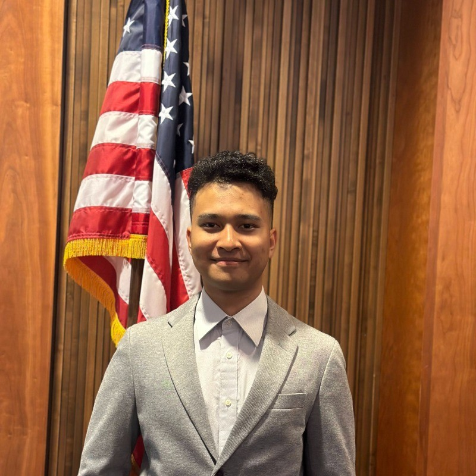

# My name is Min Aung Paing.

Welcome to my User Page! I'm a passionate programmer and student, excited about building real-world software and always learning something new.

## Pictures



## Quoting Text

"The only way to do great work  is to love what you do." – Steve Jobs

## Quoting Code
```
 #include <iostream>
    int main()
    {
        std::cout<< "Hello World";
    } 
```

## External Links
Visit [My Linkedin](https://www.linkedin.com/in/min-aung-paing/)

Visit [My Portfolio](https://mgmap.github.io/)

## Section Links
[Jump to Pictures](#-pictures)

## Relative Link
[See my Readme](./README.md)

## Link

### Ordered List
1. Learn Markdown
2. Push Github
3. Submit my lab

### Unordered List
- Vide Code
- Read
- Sleep

## Task List
- [x] Create `index.md`
- [x] Add pictures
- [x] Use all Markdown constructs
- [ ] Get feedback from a peer
- [ ] Push final version
